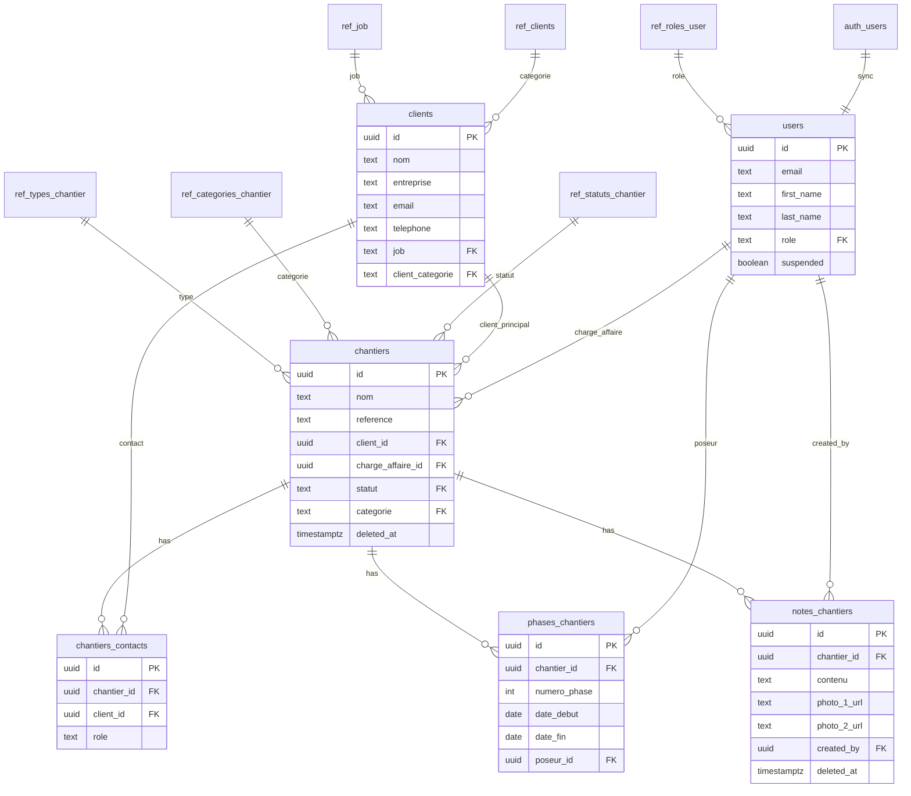
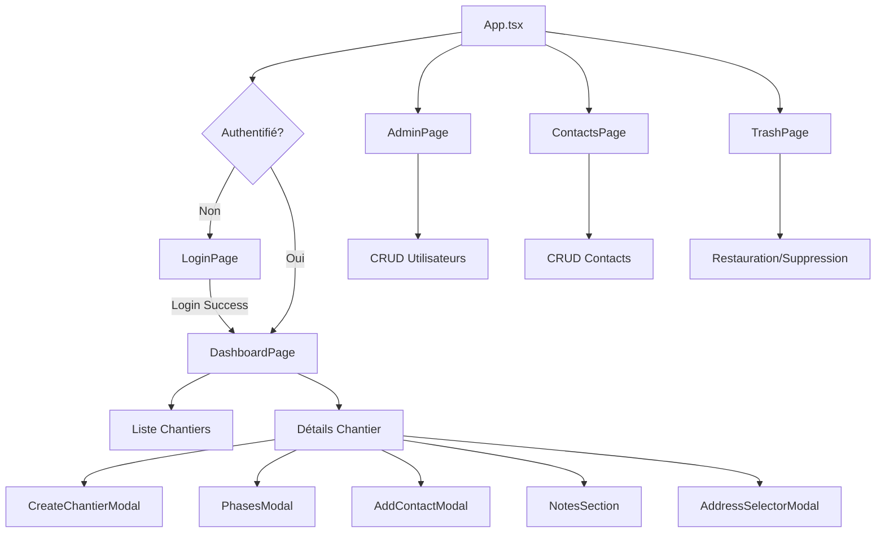
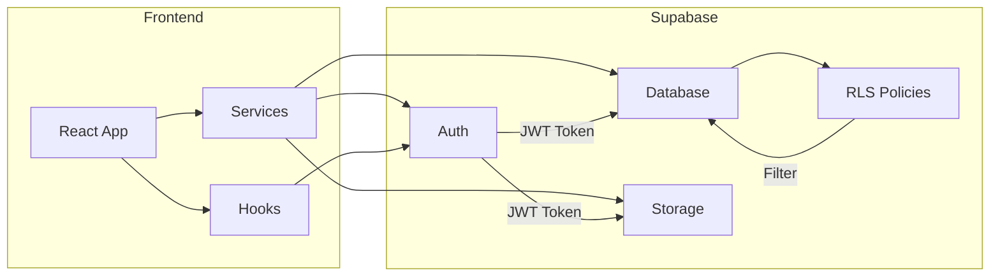
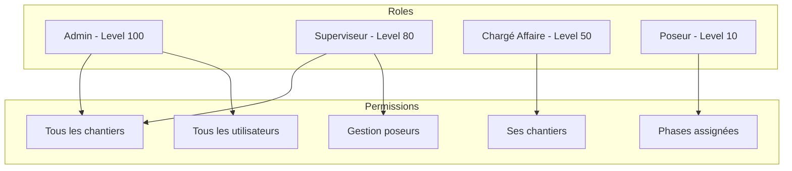

# Documentation Complète - MyDelagrave
## Application de Gestion de Chantiers

Ce document constitue une documentation exhaustive pour permettre de reconstruire l'application à partir de zéro.

---

# PARTIE 1 : STACK TECHNOLOGIQUE

## 1.1 Technologies Frontend
| Technologie | Version | Rôle |
|-------------|---------|------|
| React | 19.2.0 | Framework UI |
| TypeScript | 5.9.3 | Langage typé |
| Vite | 7.2.4 | Build tool et dev server |
| React Router | 7.11.0 | Routing (HashRouter) |
| Tailwind CSS | 4.1.18 | Styling utility-first |
| Lucide React | 0.562.0 | Icônes SVG |

## 1.2 Backend / Base de données
| Technologie | Version | Rôle |
|-------------|---------|------|
| Supabase | 2.89.0 | Backend as a Service |
| PostgreSQL | - | Base de données relationnelle |
| Supabase Auth | - | Authentification |
| Supabase Storage | - | Stockage fichiers/photos |

## 1.3 Desktop (Electron)
| Technologie | Version | Rôle |
|-------------|---------|------|
| Electron | 28.0.0 | Application desktop |
| Electron Builder | 24.9.1 | Packaging |

## 1.4 Outils
- ESLint 9.39.1 - Linting
- PostCSS 8.5.6 - Traitement CSS
- Playwright 1.57.0 - Tests E2E

---

# PARTIE 2 : STRUCTURE DES DOSSIERS

```
MyDelagrave/
├── src/                              # Code source React/TypeScript
│   ├── App.tsx                       # Composant racine + routing
│   ├── main.tsx                      # Point d'entrée React
│   │
│   ├── pages/                        # Pages principales
│   │   ├── LoginPage.tsx             # Authentification
│   │   ├── DashboardPage.tsx         # Tableau de bord (900 lignes)
│   │   ├── AdminPage.tsx             # Gestion utilisateurs (486 lignes)
│   │   ├── ContactsPage.tsx          # Gestion contacts (581 lignes)
│   │   └── TrashPage.tsx             # Corbeille (450 lignes)
│   │
│   ├── components/                   # Composants réutilisables
│   │   ├── chantiers/
│   │   │   ├── CreateChantierModal.tsx    # Création chantier
│   │   │   ├── PhasesModal.tsx            # Gestion phases
│   │   │   ├── AddContactModal.tsx        # Ajout contact
│   │   │   ├── SelectClientModal.tsx      # Sélection client
│   │   │   ├── AddressSelectorModal.tsx   # Adresse + géoloc
│   │   │   ├── NotesSection.tsx           # Notes + photos
│   │   │   ├── ChantierCard.tsx
│   │   │   └── ChantierDetail.tsx
│   │   ├── dashboard/
│   │   │   ├── KPIBar.tsx
│   │   │   └── KPICard.tsx
│   │   ├── layout/
│   │   │   ├── Layout.tsx
│   │   │   └── Sidebar.tsx
│   │   ├── ui/
│   │   │   └── ChantierStatusBadge.tsx
│   │   └── auth/
│   │       └── RequireAuth.tsx
│   │
│   ├── services/                     # Services API
│   │   ├── chantiers.ts
│   │   ├── phaseService.ts
│   │   ├── chantiersContactsService.ts
│   │   └── clients.ts
│   │
│   ├── hooks/
│   │   └── useUserRole.ts
│   │
│   ├── lib/
│   │   ├── supabase.ts               # Client Supabase
│   │   └── database.types.ts         # Types générés
│   │
│   └── utils/
│       ├── dateUtils.ts
│       ├── jobIcons.ts
│       └── workHoursCalculator.ts
│
├── electron/                         # Application desktop
│   ├── main.js
│   └── preload.js
│
├── supabase/
│   └── migrations/                   # 28 fichiers SQL
│
├── Configuration
├── vite.config.ts
├── tsconfig.json
├── tailwind.config.js
├── eslint.config.js
└── package.json
```

---

# PARTIE 3 : ROUTES DE L'APPLICATION

```typescript
/login          → LoginPage       // Authentification
/admin          → AdminPage       // Gestion utilisateurs (admin only)
/contacts       → ContactsPage    // Gestion contacts
/corbeille      → TrashPage       // Éléments supprimés
/*              → DashboardPage   // Dashboard principal (défaut)
```

---

# PARTIE 4 : STRUCTURE DE LA BASE DE DONNÉES

## 4.1 Tables Principales

### TABLE: `users`
**Fonction**: Synchronisation utilisateurs authentifiés
```sql
- id: UUID (PK, FK → auth.users.id ON DELETE CASCADE)
- email: TEXT
- first_name: TEXT
- last_name: TEXT
- role: TEXT (FK → ref_roles_user.code, DEFAULT 'poseur')
- suspended: BOOLEAN (DEFAULT FALSE)
- created_at: TIMESTAMPTZ
- updated_at: TIMESTAMPTZ
```

### TABLE: `chantiers`
**Fonction**: Projets/chantiers
```sql
- id: UUID (PK)
- reference: TEXT
- nom: TEXT (NOT NULL)
- adresse_livraison: TEXT
- adresse_livraison_latitude: NUMERIC(10,8)
- adresse_livraison_longitude: NUMERIC(11,8)
- client_id: UUID (FK → clients.id)
- charge_affaire_id: UUID (FK → users.id)
- poseur_id: UUID (FK → users.id)
- statut: TEXT (FK → ref_statuts_chantier.code, DEFAULT 'nouveau')
- categorie: TEXT (FK → ref_categories_chantier.code)
- type: TEXT (FK → ref_types_chantier.code)
- date_debut: TIMESTAMPTZ
- date_fin: TIMESTAMPTZ
- reserves_levees: BOOLEAN (DEFAULT FALSE)
- doe_fourni: BOOLEAN (DEFAULT FALSE)
- deleted_at: TIMESTAMPTZ (soft delete)
- created_at: TIMESTAMPTZ
- updated_at: TIMESTAMPTZ
```

### TABLE: `clients`
**Fonction**: Contacts/clients
```sql
- id: UUID (PK)
- nom: TEXT (NOT NULL)
- email: TEXT
- telephone: TEXT
- adresse: TEXT
- entreprise: TEXT
- job: TEXT (FK → ref_job.code)
- client_categorie: TEXT (FK → ref_clients.code, DEFAULT 'contact_client')
- created_at: TIMESTAMPTZ
- updated_at: TIMESTAMPTZ
```

### TABLE: `chantiers_contacts`
**Fonction**: Liaison chantiers-clients (many-to-many)
```sql
- id: UUID (PK)
- chantier_id: UUID (FK → chantiers.id ON DELETE CASCADE)
- client_id: UUID (FK → clients.id ON DELETE CASCADE)
- role: TEXT
- created_at: TIMESTAMPTZ
- updated_at: TIMESTAMPTZ
UNIQUE(chantier_id, client_id)
```

### TABLE: `phases_chantiers`
**Fonction**: Phases d'intervention
```sql
- id: UUID (PK)
- chantier_id: UUID (FK → chantiers.id ON DELETE CASCADE)
- numero_phase: INT
- libelle: VARCHAR(100)
- date_debut: DATE (NOT NULL)
- date_fin: DATE (NOT NULL)
- heure_debut: TIME (DEFAULT '08:00:00')
- duree_heures: INT (DEFAULT 8)
- heure_fin: TIME (DEFAULT '17:00:00')
- poseur_id: UUID (FK → users.id)
- created_at: TIMESTAMPTZ
- updated_at: TIMESTAMPTZ
UNIQUE(chantier_id, numero_phase)
CHECK(date_fin >= date_debut AND duree_heures > 0)
```

### TABLE: `notes_chantiers`
**Fonction**: Notes avec photos
```sql
- id: UUID (PK)
- chantier_id: UUID (FK → chantiers.id ON DELETE CASCADE)
- contenu: TEXT
- photo_1_url: TEXT
- photo_2_url: TEXT
- created_by: UUID (FK → users.id)
- deleted_at: TIMESTAMPTZ (soft delete)
- created_at: TIMESTAMPTZ
- updated_at: TIMESTAMPTZ
```

## 4.2 Tables de Référence

### ref_roles_user
```sql
- code: TEXT (PK) → 'admin', 'superviseur', 'charge_affaire', 'poseur'
- label: TEXT
- level: INT → 100, 80, 50, 10
- description: TEXT
```

### ref_statuts_chantier
```sql
- code: TEXT (PK) → 'nouveau', 'en_cours', 'planifie', 'pose_en_cours', 'a_terminer', 'termine'
- label: TEXT
- icon: TEXT (emoji)
- color: TEXT (hex)
```

### ref_categories_chantier
```sql
- code: TEXT (PK) → 'labo', 'en', 'hospitalier', 'autres'
- label: TEXT
- icon: TEXT
```

### ref_types_chantier
```sql
- code: TEXT (PK) → 'fourniture', 'fourniture_pose'
- label: TEXT
```

### ref_clients
```sql
- code: TEXT (PK) → 'contact_client', 'contact_chantier', etc.
- label: TEXT
- icon: TEXT
- color: TEXT
```

### ref_job
```sql
- code: TEXT (PK) → 'directeur', 'commercial', 'conducteur_travaux', etc.
- label: TEXT
- icon: TEXT (SVG)
- color: TEXT
```

## 4.3 Relations (Foreign Keys)

```
users.role → ref_roles_user(code)

chantiers.client_id → clients(id)
chantiers.charge_affaire_id → users(id) ON DELETE SET NULL
chantiers.poseur_id → users(id) ON DELETE SET NULL
chantiers.statut → ref_statuts_chantier(code)
chantiers.categorie → ref_categories_chantier(code)
chantiers.type → ref_types_chantier(code)

clients.job → ref_job(code)
clients.client_categorie → ref_clients(code)

chantiers_contacts.chantier_id → chantiers(id) ON DELETE CASCADE
chantiers_contacts.client_id → clients(id) ON DELETE CASCADE

notes_chantiers.chantier_id → chantiers(id) ON DELETE CASCADE
notes_chantiers.created_by → users(id) ON DELETE SET NULL

phases_chantiers.chantier_id → chantiers(id) ON DELETE CASCADE
phases_chantiers.poseur_id → users(id) ON DELETE SET NULL
```

## 4.4 Fonctions PostgreSQL

### get_my_role()
```sql
RETURNS TEXT - Retourne le rôle de l'utilisateur connecté
SECURITY DEFINER (bypass RLS)
```

### is_user_suspended(user_id UUID)
```sql
RETURNS BOOLEAN - Vérifie si un utilisateur est suspendu
SECURITY DEFINER (bypass RLS)
```

### calculer_statut_chantier(p_chantier_id UUID)
```sql
RETURNS VARCHAR - Calcule automatiquement le statut basé sur les phases
Logique:
- Pas de phases → statut actuel
- Phase en cours → 'pose_en_cours'
- Phase future → 'planifie'
- Toutes passées + réserves levées + DOE → 'termine'
- Sinon → 'a_terminer'
```

### trigger_update_chantier_statut()
```sql
TRIGGER AFTER INSERT/UPDATE/DELETE ON phases_chantiers
Met à jour automatiquement le statut du chantier
```

### handle_new_user()
```sql
TRIGGER AFTER INSERT ON auth.users
Synchronise auth.users → public.users
```

## 4.5 Politiques RLS (Row Level Security)

### Hiérarchie des rôles
1. **admin** (level 100) - Accès total
2. **superviseur** (level 80) - Accès total lecture, gestion poseurs
3. **charge_affaire** (level 50) - Ses chantiers uniquement
4. **poseur** (level 10) - Phases assignées uniquement

### Patterns de sécurité
- Vérification `NOT public.is_user_suspended(auth.uid())` dans toutes les policies
- Soft delete filtré avec `deleted_at IS NULL`
- Ownership via `created_by` pour les notes

## 4.6 Storage Bucket

**Bucket: `photos_notes`**
- public: false
- file_size_limit: 10MB
- allowed_mime_types: image/jpeg, image/png, image/webp, image/gif

---

# PARTIE 5 : MODULES FONCTIONNELS

## 5.1 Module Dashboard (DashboardPage.tsx)
**Rôle**: Tableau de bord principal

**Fonctionnalités**:
- KPIs: Total, Nouveaux, Non planifiés, Non attribués, En cours, Planifiés, Terminés
- Vue bipartite: liste (40%) + détails (60%)
- Filtrage par statut via KPIs
- Recherche par nom, référence, client

**Sections détail (expandables)**:
1. Infos Chantier (client + adresse)
2. Contacts Chantier
3. Planning (phases)
4. Notes (avec photos)

## 5.2 Module Contacts (ContactsPage.tsx)
**Rôle**: Base de données contacts/clients

**Fonctionnalités**:
- Vue grid responsive
- Recherche multi-champs
- Filtrage par catégorie
- CRUD complet
- Gestion des jobs avec création auto

## 5.3 Module Administration (AdminPage.tsx)
**Rôle**: Gestion des utilisateurs

**Fonctionnalités**:
- Tableau triable (nom/rôle)
- CRUD utilisateurs via Supabase Auth
- Gestion rôles: admin, superviseur, charge_affaire, poseur
- Suspension/Réactivation

## 5.4 Module Corbeille (TrashPage.tsx)
**Rôle**: Gestion suppressions logiques

**Fonctionnalités**:
- Onglets: Chantiers + Notes supprimés
- Restauration individuelle/masse
- Suppression définitive + nettoyage storage

## 5.5 Module Phases (PhasesModal.tsx)
**Rôle**: Planification phases chantier

**Fonctionnalités**:
- Liste phases numérotées
- Assignation poseur par phase
- Dates début/fin
- Heures de travail

## 5.6 Module Notes (NotesSection.tsx)
**Rôle**: Notes enrichies avec photos

**Fonctionnalités**:
- Création/Edition/Suppression
- Upload 2 photos max par note
- Drag-drop images
- Lightbox visualisation
- Soft delete

## 5.7 Module Adresses (AddressSelectorModal.tsx)
**Rôle**: Géolocalisation chantiers

**Fonctionnalités**:
- 3 modes: Adresse client, Saisie manuelle, Carte
- Géocodage Nominatim (OSM)
- Carte interactive Leaflet
- Récupération GPS

---

# PARTIE 6 : SERVICES API

## chantiersService.ts
```typescript
getAll(): Chantier[]      // Avec relations (client, statut, catégorie, CA)
create(chantier): Chantier
```

## phaseService.ts
```typescript
getByChantier(chantierId): PhaseWithPoseur[]
create(phase): Phase
update(id, updates): Phase
delete(id): void
getNextPhaseNumber(chantierId): number
reorderPhases(chantierId): void
```

## chantiersContactsService.ts
```typescript
getByChantier(chantierId): ChantierContact[]
add(chantierId, clientId, role?): ChantierContact
remove(id): void
updateRole(id, role): void
```

## clientsService.ts
```typescript
getAll(): Client[]
create(client): Client
```

---

# PARTIE 7 : HOOKS PERSONNALISÉS

## useUserRole()
```typescript
Returns {
  role: 'admin' | 'superviseur' | 'charge_affaire' | 'poseur' | null
  loading: boolean
  error: string | null
  isAdmin: boolean
  isPoseur: boolean
}
```

---

# PARTIE 8 : VARIABLES D'ENVIRONNEMENT

## Production (.env)
```
VITE_SUPABASE_URL=https://cuitjiyntcvoqecrsimn.supabase.co
VITE_SUPABASE_ANON_KEY=eyJhbGci...
```

## Développement local (.env.local)
```
VITE_SUPABASE_URL=http://127.0.0.1:64321
VITE_SUPABASE_ANON_KEY=eyJhbGci...
```

---

# PARTIE 9 : CONFIGURATION ELECTRON

## Fenêtres
- Principale: 1400x900 sur écran principal
- Secondaire: 1000x800 sur écran externe (si disponible)

## IPC Events
- `user-logged-in` → crée fenêtre secondaire
- `user-logged-out` → ferme fenêtre secondaire
- `open-second-window` → ouverture manuelle

## Build Config
```json
{
  "appId": "com.mydelagrave.gestionchantier",
  "productName": "Gestion Chantier",
  "win": { "target": "nsis" }
}
```

---

# PARTIE 10 : THÈME ET STYLES

## Couleurs Tailwind personnalisées
```javascript
colors: {
  'app-bg': '#0f172a',         // Slate 900
  'app-secondary': '#1e293b',  // Slate 800
  'glass': 'rgba(30, 41, 59, 0.6)',
  'glass-border': 'rgba(148, 163, 184, 0.1)',
}
```

## Pattern Glass Morphism
- Background semi-transparent
- Backdrop blur 20px
- Shadow glass effect

---

# PARTIE 11 : COMMANDES NPM

```bash
npm run dev              # Dev server Vite
npm run build            # Build production
npm run lint             # ESLint
npm run electron:dev     # Electron dev
npm run electron:build   # Build desktop
npm run test:e2e         # Tests Playwright
```

---

# PARTIE 12 : RECONSTRUCTION

## Étapes pour reconstruire

1. **Initialiser le projet**
   ```bash
   npm create vite@latest mydelagrave -- --template react-ts
   cd mydelagrave
   ```

2. **Installer les dépendances**
   ```bash
   npm install @supabase/supabase-js react-router-dom lucide-react leaflet react-leaflet
   npm install -D tailwindcss postcss autoprefixer electron electron-builder
   ```

3. **Configurer Supabase**
   - Créer projet sur supabase.com
   - Appliquer les migrations SQL
   - Configurer les politiques RLS

4. **Créer la structure des dossiers**
   - src/pages, components, services, hooks, lib, utils

5. **Implémenter les modules** dans l'ordre:
   1. Authentification (LoginPage + useUserRole)
   2. Tables de référence et types
   3. Module Clients
   4. Module Chantiers
   5. Module Phases
   6. Module Notes
   7. Module Administration
   8. Module Corbeille

---

# PARTIE 13 : DIAGRAMMES D'ARCHITECTURE

## 13.1 Diagramme Entité-Relation (Base de données)



## 13.2 Flux de Navigation (Application)



## 13.3 Flux de Données (Supabase)



## 13.4 Architecture des Rôles (RBAC)



---

# PARTIE 14 : CODE DES COMPOSANTS CLÉS

## 14.1 App.tsx (Point d'entrée + Routing)

```typescript
import { Routes, Route, Navigate } from 'react-router-dom';
import { useEffect, useState } from 'react';
import { supabase } from './lib/supabase';
import { LoginPage } from './pages/LoginPage';
import { DashboardPage } from './pages/DashboardPage';
import { AdminPage } from './pages/AdminPage';
import { ContactsPage } from './pages/ContactsPage';
import { TrashPage } from './pages/TrashPage';
import type { User } from '@supabase/supabase-js';

function App() {
  const [user, setUser] = useState<User | null>(null);
  const [loading, setLoading] = useState(true);

  useEffect(() => {
    // Check initial session
    supabase.auth.getSession().then(({ data: { session } }) => {
      setUser(session?.user ?? null);
      setLoading(false);
    });

    // Listen for auth changes
    const { data: { subscription } } = supabase.auth.onAuthStateChange((_event, session) => {
      setUser(session?.user ?? null);
    });

    return () => subscription.unsubscribe();
  }, []);

  if (loading) {
    return (
      <div className="h-screen flex items-center justify-center bg-slate-900">
        <div className="text-xl text-white animate-pulse">Chargement...</div>
      </div>
    );
  }

  return (
    <Routes>
      <Route path="/login" element={user ? <Navigate to="/" replace /> : <LoginPage />} />
      <Route path="/admin" element={user ? <AdminPage /> : <Navigate to="/login" replace />} />
      <Route path="/corbeille" element={user ? <TrashPage /> : <Navigate to="/login" replace />} />
      <Route path="/contacts" element={user ? <ContactsPage /> : <Navigate to="/login" replace />} />
      <Route path="/*" element={user ? <DashboardPage /> : <Navigate to="/login" replace />} />
    </Routes>
  );
}

export default App;
```

## 14.2 supabase.ts (Client Supabase)

```typescript
import { createClient } from '@supabase/supabase-js';

const supabaseUrl = import.meta.env.VITE_SUPABASE_URL;
const supabaseAnonKey = import.meta.env.VITE_SUPABASE_ANON_KEY;

if (!supabaseUrl || !supabaseAnonKey) {
    console.warn("Supabase credentials missing. Check .env.local");
}

export const supabase = createClient(
    supabaseUrl || '',
    supabaseAnonKey || ''
);
```

## 14.3 useUserRole.ts (Hook de rôle)

```typescript
import { useEffect, useState } from 'react';
import { supabase } from '../lib/supabase';
import type { Database } from '../lib/database.types';

type UserRole = Database['public']['Tables']['ref_roles_user']['Row']['code'] | null;

export function useUserRole() {
    const [role, setRole] = useState<UserRole>(null);
    const [loading, setLoading] = useState(true);
    const [error, setError] = useState<string | null>(null);

    useEffect(() => {
        async function fetchRole() {
            try {
                const { data: { user } } = await supabase.auth.getUser();

                if (!user) {
                    setRole(null);
                    setLoading(false);
                    return;
                }

                const { data, error } = await supabase
                    .from('users')
                    .select('role')
                    .eq('id', user.id)
                    .single();

                if (error) {
                    console.error('Error fetching user role:', error);
                    setError(error.message);
                }

                if (data) {
                    setRole(data.role);
                }
            } catch (err: any) {
                setError(err.message);
            } finally {
                setLoading(false);
            }
        }

        fetchRole();

        const { data: { subscription } } = supabase.auth.onAuthStateChange(() => {
            fetchRole();
        });

        return () => subscription.unsubscribe();
    }, []);

    return { role, loading, error, isAdmin: role === 'admin', isPoseur: role === 'poseur' };
}
```

## 14.4 chantiersService.ts (Service Chantiers)

```typescript
import { supabase } from '../lib/supabase';
import type { Database } from '../lib/database.types';

export type Chantier = Database['public']['Tables']['chantiers']['Row'] & {
    client: Database['public']['Tables']['clients']['Row'] | null;
    ref_statuts_chantier: Database['public']['Tables']['ref_statuts_chantier']['Row'] | null;
    ref_categories_chantier: Database['public']['Tables']['ref_categories_chantier']['Row'] | null;
    charge_affaire: Database['public']['Tables']['users']['Row'] | null;
};

export const chantiersService = {
    async getAll() {
        const { data, error } = await supabase
            .from('chantiers')
            .select(`
                *,
                client:clients(*),
                ref_statuts_chantier(*),
                ref_categories_chantier:ref_categories_chantier!chantiers_categorie_fkey(*),
                charge_affaire:users!chantiers_charge_affaire_id_fkey(*)
            `)
            .order('updated_at', { ascending: false });

        if (error) throw error;
        return data as Chantier[];
    },

    async create(chantier: { nom: string; client_id?: string; adresse?: string; charge_affaire_id?: string }) {
        const { data, error } = await supabase
            .from('chantiers')
            .insert([{ ...chantier, statut: 'nouveau' }])
            .select()
            .single();

        if (error) throw error;
        return data;
    }
};
```

## 14.5 phaseService.ts (Service Phases)

```typescript
import { supabase } from '../lib/supabase';
import type { Database } from '../lib/database.types';

type PhaseRow = Database['public']['Tables']['phases_chantiers']['Row'];
type PhaseInsert = Database['public']['Tables']['phases_chantiers']['Insert'];
type PhaseUpdate = Database['public']['Tables']['phases_chantiers']['Update'];

export interface PhaseWithPoseur extends PhaseRow {
    poseur?: { id: string; first_name: string | null; last_name: string | null; } | null;
}

export const phaseService = {
    async getByChantier(chantierId: string): Promise<PhaseWithPoseur[]> {
        const { data, error } = await supabase
            .from('phases_chantiers')
            .select(`*, poseur:users!phases_chantiers_poseur_id_fkey (id, first_name, last_name)`)
            .eq('chantier_id', chantierId)
            .order('date_debut', { ascending: true });

        if (error) throw error;
        return data || [];
    },

    async create(phase: Omit<PhaseInsert, 'id' | 'created_at' | 'updated_at'>): Promise<PhaseRow> {
        const { data, error } = await supabase
            .from('phases_chantiers')
            .insert(phase)
            .select()
            .single();

        if (error) throw error;
        return data;
    },

    async update(id: string, updates: PhaseUpdate): Promise<PhaseRow> {
        const { data, error } = await supabase
            .from('phases_chantiers')
            .update(updates)
            .eq('id', id)
            .select()
            .single();

        if (error) throw error;
        return data;
    },

    async delete(id: string): Promise<void> {
        const { error } = await supabase.from('phases_chantiers').delete().eq('id', id);
        if (error) throw error;
    },

    async getNextPhaseNumber(chantierId: string): Promise<number> {
        const { data, error } = await supabase
            .from('phases_chantiers')
            .select('numero_phase')
            .eq('chantier_id', chantierId)
            .order('numero_phase', { ascending: false })
            .limit(1);

        if (error) return 1;
        return data && data.length > 0 ? data[0].numero_phase + 1 : 1;
    }
};
```

---

# PARTIE 15 : SCRIPT SQL CONSOLIDÉ (Structure finale)

Ce script crée toute la structure de base de données en une seule exécution.
Voir le fichier séparé: `supabase/schema_consolidated.sql`

---

# PARTIE 16 : PROMPT CONDENSÉ POUR IA

Copiez ce texte pour démarrer une nouvelle conversation avec un assistant IA :

---

## PROMPT DE CONTEXTE - MyDelagrave

**Application**: Gestion de chantiers pour entreprise de pose
**Stack**: React 19 + TypeScript + Vite + Tailwind CSS + Supabase + Electron

### Architecture

**Frontend (React)**:
- Pages: LoginPage, DashboardPage, AdminPage, ContactsPage, TrashPage
- Composants: CreateChantierModal, PhasesModal, AddContactModal, NotesSection, AddressSelectorModal
- Services: chantiersService, phaseService, clientsService, chantiersContactsService
- Hook: useUserRole (récupère rôle utilisateur)

**Base de données (Supabase PostgreSQL)**:
- Tables principales: users, chantiers, clients, phases_chantiers, notes_chantiers, chantiers_contacts
- Tables référence: ref_roles_user, ref_statuts_chantier, ref_categories_chantier, ref_types_chantier, ref_clients, ref_job
- Fonctions: get_my_role(), is_user_suspended(), calculer_statut_chantier()
- RLS activé avec hiérarchie: admin > superviseur > charge_affaire > poseur
- Soft delete avec colonne deleted_at

**Fonctionnalités**:
1. Dashboard avec KPIs et liste chantiers filtrables
2. Gestion phases de travail avec assignation poseurs
3. Notes avec upload photos (2 max, Supabase Storage)
4. Contacts multiples par chantier (many-to-many)
5. Géolocalisation adresses (Leaflet + Nominatim)
6. Administration utilisateurs avec rôles
7. Corbeille avec restauration

**Patterns utilisés**:
- Services pour abstraction Supabase
- Modales pour CRUD
- Soft delete (deleted_at)
- RLS avec SECURITY DEFINER functions
- Triggers auto-update statut chantier

**Thème**: Dark mode (Slate 900/800) avec glass morphism

---

**Version**: 0.01.17
**Date**: 2026-01-02
