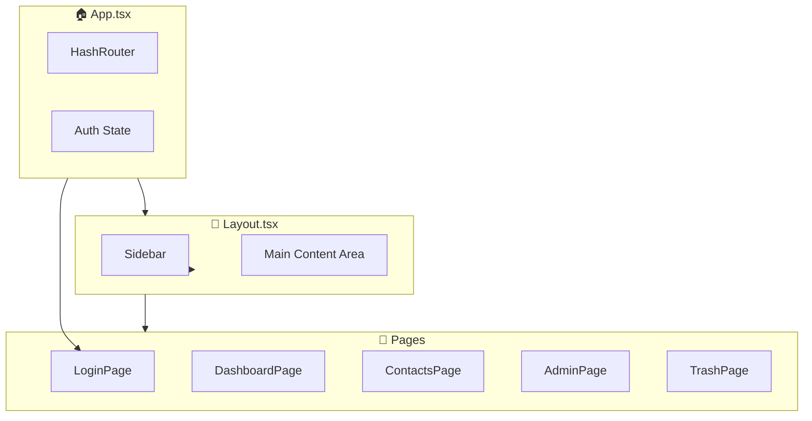

# 🗺️ Zones et Composants UI - MyDelagrave

## Vue d'ensemble de l'architecture



---

## 📊 Dashboard Page - Zones

```
┌─────────────────────────────────────────────────────────────────────────────┐
│  HEADER                                                                      │
│  ┌─────────────────────────────────┐  ┌──────────────┐ ┌─────────────────┐  │
│  │ Titre: "Tableau de bord"        │  │ Actualiser   │ │ Nouveau chantier│  │
│  │ Sous-titre: "X chantiers"       │  └──────────────┘ └─────────────────┘  │
│  └─────────────────────────────────┘                                         │
├─────────────────────────────────────────────────────────────────────────────┤
│  KPI BAR (KPIBar.tsx + KPICard.tsx)                                         │
│  ┌──────────┐ ┌──────────┐ ┌──────────┐ ┌──────────┐ ┌──────────┐          │
│  │  Total   │ │ Nouveaux │ │Non planif│ │Non attrib│ │ En cours │          │
│  │   12     │ │    3     │ │    2     │ │    1     │ │    5     │          │
│  └──────────┘ └──────────┘ └──────────┘ └──────────┘ └──────────┘          │
├─────────────────────────────────────────────────────────────────────────────┤
│                                                                              │
│  ┌─────────────────────────────┐  ┌────────────────────────────────────────┐│
│  │  LISTE CHANTIERS (40%)      │  │  PANNEAU DÉTAILS (60%)                 ││
│  │                             │  │                                        ││
│  │  ┌─────────────────────┐    │  │  ChantierDetail.tsx                    ││
│  │  │ 🔍 Recherche...     │    │  │  ┌────────────────────────────────┐   ││
│  │  └─────────────────────┘    │  │  │ HEADER: Nom + Statut + Actions │   ││
│  │                             │  │  │ [Modifier] [Supprimer]         │   ││
│  │  ┌─────────────────────┐    │  │  └────────────────────────────────┘   ││
│  │  │ ChantierCard        │    │  │                                        ││
│  │  │ - Nom               │    │  │  ┌──────────────┐ ┌──────────────┐    ││
│  │  │ - Référence         │    │  │  │   Phases     │ │   Contacts   │    ││
│  │  │ - Client            │    │  │  │   Button     │ │   Button     │    ││
│  │  │ - Dates             │    │  │  └──────────────┘ └──────────────┘    ││
│  │  └─────────────────────┘    │  │                                        ││
│  │                             │  │  ┌────────────────────────────────┐   ││
│  │  ┌─────────────────────┐    │  │  │ Section: Client principal      │   ││
│  │  │ ChantierCard        │    │  │  └────────────────────────────────┘   ││
│  │  │ (selected state)    │    │  │                                        ││
│  │  └─────────────────────┘    │  │  ┌────────────────────────────────┐   ││
│  │                             │  │  │ Section: Adresse livraison     │   ││
│  │  ┌─────────────────────┐    │  │  └────────────────────────────────┘   ││
│  │  │ ChantierCard        │    │  │                                        ││
│  │  └─────────────────────┘    │  │  ┌────────────────────────────────┐   ││
│  │                             │  │  │ Section: Informations/Dates    │   ││
│  └─────────────────────────────┘  │  └────────────────────────────────┘   ││
│                                   └────────────────────────────────────────┘│
└─────────────────────────────────────────────────────────────────────────────┘
```

---

## 🪟 Modales

### CreateChantierModal.tsx
```
┌─────────────────────────────────────────────────────────────────┐
│  ╔═══════════════════════════════════════════════════════════╗  │
│  ║ 🏗️ Nouveau chantier / Modifier le chantier          [X]  ║  │
│  ╠═══════════════════════════════════════════════════════════╣  │
│  ║ Section: INFORMATIONS GÉNÉRALES                           ║  │
│  ║ ┌─────────────────────────────────────────────────────┐   ║  │
│  ║ │ Nom du chantier *                                   │   ║  │
│  ║ └─────────────────────────────────────────────────────┘   ║  │
│  ║ ┌────────────────┐  ┌────────────────┐                    ║  │
│  ║ │ Référence      │  │ Statut ▼       │                    ║  │
│  ║ └────────────────┘  └────────────────┘                    ║  │
│  ║ ┌────────────────┐  ┌────────────────┐                    ║  │
│  ║ │ Catégorie ▼    │  │ Type ▼         │                    ║  │
│  ║ └────────────────┘  └────────────────┘                    ║  │
│  ╠═══════════════════════════════════════════════════════════╣  │
│  ║ Section: CLIENT ET LOCALISATION                           ║  │
│  ║ ┌─────────────────────────────────────────────────────┐   ║  │
│  ║ │ Client principal ▼                                  │   ║  │
│  ║ └─────────────────────────────────────────────────────┘   ║  │
│  ║ ┌─────────────────────────────────────────────┐ ┌─────┐   ║  │
│  ║ │ Adresse de livraison                        │ │ 🗺️ │   ║  │
│  ║ └─────────────────────────────────────────────┘ └─────┘   ║  │
│  ╠═══════════════════════════════════════════════════════════╣  │
│  ║ Section: ÉQUIPE ASSIGNÉE                                  ║  │
│  ║ ┌────────────────┐  ┌────────────────┐                    ║  │
│  ║ │ Chargé aff. ▼  │  │ Poseur ▼       │                    ║  │
│  ║ └────────────────┘  └────────────────┘                    ║  │
│  ╠═══════════════════════════════════════════════════════════╣  │
│  ║ Section: PLANNING                                         ║  │
│  ║ ┌────────────────┐  ┌────────────────┐                    ║  │
│  ║ │ Date début 📅  │  │ Date fin 📅    │                    ║  │
│  ║ └────────────────┘  └────────────────┘                    ║  │
│  ╠═══════════════════════════════════════════════════════════╣  │
│  ║              [Annuler]    [Créer le chantier]             ║  │
│  ╚═══════════════════════════════════════════════════════════╝  │
└─────────────────────────────────────────────────────────────────┘
```

### PhasesModal.tsx
```
┌─────────────────────────────────────────────────────────────────┐
│  ╔═══════════════════════════════════════════════════════════╗  │
│  ║ ⏱️ Gestion des phases - [Nom chantier]              [X]   ║  │
│  ╠═══════════════════════════════════════════════════════════╣  │
│  ║                                     [+ Ajouter une phase] ║  │
│  ║                                                           ║  │
│  ║  ┌─────────────────────────────────────────────────────┐  ║  │
│  ║  │ Phase 1: Préparation                                │  ║  │
│  ║  │ 📅 01/01 → 15/01  👤 Jean Dupont     [✏️] [🗑️]     │  ║  │
│  ║  └─────────────────────────────────────────────────────┘  ║  │
│  ║                                                           ║  │
│  ║  ┌─────────────────────────────────────────────────────┐  ║  │
│  ║  │ Phase 2: Pose                                       │  ║  │
│  ║  │ 📅 16/01 → 30/01  👤 Pierre Martin   [✏️] [🗑️]     │  ║  │
│  ║  └─────────────────────────────────────────────────────┘  ║  │
│  ║                                                           ║  │
│  ║  ┌─────────────────────────────────────────────────────┐  ║  │
│  ║  │ 📝 FORMULAIRE D'AJOUT/ÉDITION                       │  ║  │
│  ║  │ Nom: [_________________]                            │  ║  │
│  ║  │ Début: [____] Fin: [____] Poseur: [________▼]       │  ║  │
│  ║  │               [Annuler] [Enregistrer]               │  ║  │
│  ║  └─────────────────────────────────────────────────────┘  ║  │
│  ╠═══════════════════════════════════════════════════════════╣  │
│  ║                                            [Fermer]       ║  │
│  ╚═══════════════════════════════════════════════════════════╝  │
└─────────────────────────────────────────────────────────────────┘
```

### AddContactModal.tsx
```
┌─────────────────────────────────────────────────────────────────┐
│  ╔═══════════════════════════════════════════════════════════╗  │
│  ║ 👥 Contacts du chantier - [Nom chantier]            [X]   ║  │
│  ╠═══════════════════════════════════════════════════════════╣  │
│  ║                                   [+ Ajouter un contact]  ║  │
│  ║                                                           ║  │
│  ║  ┌─────────────────────────────────────────────────────┐  ║  │
│  ║  │ 👤 Marie Durand                                     │  ║  │
│  ║  │    Architecte Design                   [🗑️]         │  ║  │
│  ║  │    Rôle: [Client principal____▼]                    │  ║  │
│  ║  └─────────────────────────────────────────────────────┘  ║  │
│  ║                                                           ║  │
│  ║  ┌─────────────────────────────────────────────────────┐  ║  │
│  ║  │ 👤 Paul Martin                                      │  ║  │
│  ║  │    Électricité Plus                    [🗑️]         │  ║  │
│  ║  │    Rôle: [Sous-traitant___▼]                        │  ║  │
│  ║  └─────────────────────────────────────────────────────┘  ║  │
│  ╠═══════════════════════════════════════════════════════════╣  │
│  ║                                            [Fermer]       ║  │
│  ╚═══════════════════════════════════════════════════════════╝  │
└─────────────────────────────────────────────────────────────────┘
```

### SelectClientModal.tsx
```
┌─────────────────────────────────────────────────────────────────┐
│  ╔═══════════════════════════════════════════════════════════╗  │
│  ║ 👤 Sélectionner un contact                          [X]   ║  │
│  ╠═══════════════════════════════════════════════════════════╣  │
│  ║  ┌─────────────────────────────────────────────────────┐  ║  │
│  ║  │ 🔍 Rechercher...                                    │  ║  │
│  ║  └─────────────────────────────────────────────────────┘  ║  │
│  ║                                                           ║  │
│  ║  ┌─────────────────────────────────────────────────────┐  ║  │
│  ║  │ ○ Marie Durand - Architecte Design                  │  ║  │
│  ║  └─────────────────────────────────────────────────────┘  ║  │
│  ║  ┌─────────────────────────────────────────────────────┐  ║  │
│  ║  │ ◉ Paul Martin - Électricité Plus (sélectionné)      │  ║  │
│  ║  └─────────────────────────────────────────────────────┘  ║  │
│  ║  ┌─────────────────────────────────────────────────────┐  ║  │
│  ║  │ ○ Sophie Bernard - Client particulier               │  ║  │
│  ║  └─────────────────────────────────────────────────────┘  ║  │
│  ╠═══════════════════════════════════════════════════════════╣  │
│  ║               [Annuler]          [Sélectionner]           ║  │
│  ╚═══════════════════════════════════════════════════════════╝  │
└─────────────────────────────────────────────────────────────────┘
```

### AddressSelectorModal.tsx
```
┌─────────────────────────────────────────────────────────────────┐
│  ╔═══════════════════════════════════════════════════════════╗  │
│  ║ 📍 Sélectionner une adresse                         [X]   ║  │
│  ╠═══════════════════════════════════════════════════════════╣  │
│  ║  ┌────────────────────────────────┐ [Rechercher] [📍]     ║  │
│  ║  │ 🔍 Rechercher une adresse...   │                       ║  │
│  ║  └────────────────────────────────┘                       ║  │
│  ║  ┌─────────────────────────────────────────────────────┐  ║  │
│  ║  │ Résultat 1: CHU Nantes...                           │  ║  │
│  ║  │ Résultat 2: Place du Commerce...                    │  ║  │
│  ║  └─────────────────────────────────────────────────────┘  ║  │
│  ╠═══════════════════════════════════════════════════════════╣  │
│  ║  ┌─────────────────────────────────────────────────────┐  ║  │
│  ║  │                                                     │  ║  │
│  ║  │                  🗺️ LEAFLET MAP                     │  ║  │
│  ║  │                                                     │  ║  │
│  ║  │                       📍                            │  ║  │
│  ║  │                                                     │  ║  │
│  ║  └─────────────────────────────────────────────────────┘  ║  │
│  ╠═══════════════════════════════════════════════════════════╣  │
│  ║  Adresse: Place du Commerce, Nantes                       ║  │
│  ║  Coords: 47.2184, -1.5536                                 ║  │
│  ╠═══════════════════════════════════════════════════════════╣  │
│  ║               [Annuler]          [✓ Confirmer]            ║  │
│  ╚═══════════════════════════════════════════════════════════╝  │
└─────────────────────────────────────────────────────────────────┘
```

### CreateContactModal.tsx
```
┌─────────────────────────────────────────────────────────────────┐
│  ╔═══════════════════════════════════════════════════════════╗  │
│  ║ 👤 Nouveau contact                                  [X]   ║  │
│  ╠═══════════════════════════════════════════════════════════╣  │
│  ║  ┌────────────────────┐  ┌────────────────────┐           ║  │
│  ║  │ 🏢 Entreprise *    │  │ 👤 Nom             │           ║  │
│  ║  └────────────────────┘  └────────────────────┘           ║  │
│  ║  ┌────────────────────┐  ┌────────────────────┐           ║  │
│  ║  │ 📧 Email           │  │ 📞 Téléphone       │           ║  │
│  ║  └────────────────────┘  └────────────────────┘           ║  │
│  ║  ┌────────────────────┐  ┌────────────────────┐           ║  │
│  ║  │ 💼 Fonction ▼      │  │ Catégorie ▼        │           ║  │
│  ║  └────────────────────┘  └────────────────────┘           ║  │
│  ║  ┌─────────────────────────────────────────────┐ ┌─────┐  ║  │
│  ║  │ 📍 Adresse                                  │ │ 🗺️ │  ║  │
│  ║  └─────────────────────────────────────────────┘ └─────┘  ║  │
│  ║  ┌─────────────────────────────────────────────────────┐  ║  │
│  ║  │ 🏢 Bâtiment / Complément                            │  ║  │
│  ║  └─────────────────────────────────────────────────────┘  ║  │
│  ╠═══════════════════════════════════════════════════════════╣  │
│  ║               [Annuler]          [Créer le contact]       ║  │
│  ╚═══════════════════════════════════════════════════════════╝  │
└─────────────────────────────────────────────────────────────────┘
```

### ConfirmModal.tsx
```
┌─────────────────────────────────────────────────────────────────┐
│  ╔═══════════════════════════════════════════════════════════╗  │
│  ║  ┌────────┐                                               ║  │
│  ║  │ 🗑️/⚠️ │  Titre de confirmation                 [X]   ║  │
│  ║  │ (icon) │                                               ║  │
│  ║  └────────┘  Message descriptif de l'action               ║  │
│  ║              à confirmer...                               ║  │
│  ║                                                           ║  │
│  ║              ┌──────────┐  ┌──────────────────┐           ║  │
│  ║              │ Annuler  │  │ Confirmer/Suppr. │           ║  │
│  ║              └──────────┘  └──────────────────┘           ║  │
│  ╚═══════════════════════════════════════════════════════════╝  │
└─────────────────────────────────────────────────────────────────┘

Variantes:
- danger  : Icône 🗑️ rouge, bouton rouge (suppression)
- warning : Icône ⚠️ jaune, bouton jaune (avertissement)
- info    : Icône ℹ️ bleu, bouton bleu (information)
```

---

## 📂 Structure des fichiers composants

```
src/
├── App.tsx                 # Composant principal avec routing
├── main.tsx                # Point d'entrée React
│
├── components/
│   ├── layout/
│   │   ├── Layout.tsx          # Conteneur principal avec sidebar
│   │   └── Sidebar.tsx         # Navigation latérale
│   │
│   ├── dashboard/
│   │   ├── KPIBar.tsx          # Conteneur des cartes KPI
│   │   └── KPICard.tsx         # Carte KPI individuelle
│   │
│   ├── chantiers/
│   │   ├── ChantierCard.tsx        # Carte dans la liste
│   │   ├── ChantierDetail.tsx      # Panneau détails
│   │   ├── CreateChantierModal.tsx # Modal création/édition chantier
│   │   ├── CreateContactModal.tsx  # Modal création contact
│   │   ├── PhasesModal.tsx         # Modal gestion phases
│   │   ├── NotesSection.tsx        # Section notes avec photos
│   │   ├── AddContactModal.tsx     # Modal contacts chantier
│   │   ├── SelectClientModal.tsx   # Modal sélection contact
│   │   └── AddressSelectorModal.tsx# Modal carte Leaflet
│   │
│   └── ui/
│       ├── ChantierStatusBadge.tsx # Badge statut coloré
│       └── ConfirmModal.tsx        # Modal confirmation générique
│
├── hooks/
│   └── useUserRole.ts      # Hook authentification/permissions
│
├── lib/
│   ├── database.types.ts   # Types Supabase
│   ├── mockData.ts         # Données mock pour dev
│   └── supabase.ts         # Client Supabase
│
└── pages/
    ├── LoginPage.tsx       # Page connexion
    ├── DashboardPage.tsx   # Tableau de bord
    ├── ContactsPage.tsx    # Gestion contacts
    ├── AdminPage.tsx       # Administration (modal inline)
    └── TrashPage.tsx       # Corbeille (chantiers, notes, contacts)
```

---

## 🎨 Composants UI réutilisables

| Composant | Classe CSS | Description |
|-----------|------------|-------------|
| **Bouton primaire** | `.btn-primary` | Bleu, actions principales |
| **Bouton secondaire** | `.btn-secondary` | Gris, actions secondaires |
| **Bouton danger** | `.btn-danger` | Rouge, suppression |
| **Champ texte** | `.input-field` | Input stylisé dark |
| **Label** | `.input-label` | Label au-dessus du champ |
| **Carte glass** | `.glass-card` | Effet glassmorphism |
| **Modal backdrop** | `.modal-backdrop` | Fond sombre flou |
| **Badge statut** | `.status-badge` | Badge coloré par statut |
| **ConfirmModal** | `ConfirmModal.tsx` | Dialog de confirmation (danger/warning/info) |

---

## 📋 Inventaire des Modales

| Modal | Fichier | Description |
|-------|---------|-------------|
| Création chantier | `CreateChantierModal.tsx` | Créer/modifier un chantier |
| Gestion phases | `PhasesModal.tsx` | Gérer les phases d'un chantier |
| Contacts chantier | `AddContactModal.tsx` | Ajouter/gérer contacts d'un chantier |
| Sélection contact | `SelectClientModal.tsx` | Sélectionner un contact existant |
| Sélection adresse | `AddressSelectorModal.tsx` | Carte Leaflet pour adresses |
| Création contact | `CreateContactModal.tsx` | Créer un nouveau contact |
| Confirmation | `ConfirmModal.tsx` | Confirmer une action (suppression, etc.) |
| Utilisateur | `AdminPage.tsx` (inline) | Créer/modifier utilisateur |
