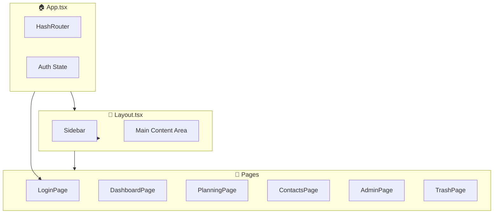

# 🗺️ Zones et Composants UI - MyDelagrave

## Vue d'ensemble de l'architecture



---

## 📅 Planning Page - Zones

```
┌─────────────────────────────────────────────────────────────────────────────┐
│  HEADER                                                                      │
│  ┌─────────┐ ┌───┬─────────────┬───┐ ┌─────────────────┐ ┌───────────────┐  │
│  │Planning │ │ ◀ │ Semaine 1   │ ▶ │ │ 25 déc - 5 jan  │ │Hebdo│3Sem│Mois│  │
│  └─────────┘ └───┴─────────────┴───┘ └─────────────────┘ └───────────────┘  │
│                                                          ┌─────────────────┐ │
│                                                          │Tous les poseurs▼│ │
│                                                          └─────────────────┘ │
├─────────────────────────────────────────────────────────────────────────────┤
│ ┌──────────────┐ ┌──────────────────────────────────────────────────────┐ │
│ │ À ATTRIBUER  │ │ CALENDRIER (PlanningCalendar.tsx)                    │ │
│ │ (Arborescence│ │                                                       │ │
│ │  v1.4.0)     │ │ ┌────────┬─────┬─────┬─────┬─────┬─────┬─────┬─────┐ │ │
│ │              │ │ │ Poseur │ Lun │ Mar │ Mer │ Jeu │ Ven ║ Lun │ Mar │ │ │
│ │ CHU-2026-001 │ │ │        │ 29  │ 30  │ 31  │ 01  │ 02  ║ 05  │ 06  │ │ │
│ │ ┌──────────┐ │ │ ├────────┼─────┴─────┴─────┴─────┴─────╫─────┴─────┤ │ │
│ │ │▼ P1 Prép │ │ │ │J.Dupont│[1.1]████ Phase ████████████║           │ │ │
│ │ │  └1.1 20h│ │ │ │2 phases│                             ║           │ │ │
│ │ │  └1.2 30h│ │ │ ├────────┼─────────────────────────────╫───────────┤ │ │
│ │ └──────────┘ │ │ │M.Martin│     [2.1]███ Préparation ███║           │ │ │
│ │ ┌──────────┐ │ │ │1 phase │                             ║           │ │ │
│ │ │▶ P2 Inst │ │ │ ├────────┼─────────────────────────────╫───────────┤ │ │
│ │ │  (3)     │ │ │ │Sans    │     🚚████ Fourniture █████║           │ │ │
│ │ └──────────┘ │ │ │pose    │                             ║           │ │ │
│ │              │ │ └────────┴─────────────────────────────╨───────────┘ │ │
│ │ Glissez une  │ │                                                       │ │
│ │ sous-phase   │ │ ║ = Séparateur week-end (ligne dorée)                 │ │
│ │ vers poseur  │ │ 🔴 = Jour férié (fond rouge léger)                    │ │
│ └──────────────┘ │ 🔵 = Aujourd'hui (fond bleu léger)                    │ │
│                  │ [X.Y] = Numéro sous-phase (groupe.numero)             │ │
│                  └──────────────────────────────────────────────────────┘ │
└─────────────────────────────────────────────────────────────────────────────┘
```

### Navigation

| Mode | Clic ◀ ▶ | Shift + Molette |
|------|----------|-----------------|
| **Hebdo** | ±1 jour | ±1 jour |
| **3 Sem** | ±7 jours | ±1 jour |
| **Mois** | ±7 jours | ±1 jour |

- **Shift + Molette** : Actif uniquement quand la souris est sur le calendrier
- **Curseur** : Change en `↔` quand Shift est enfoncé sur le calendrier

### Composants Planning

| Fichier | Description |
|---------|-------------|
| `PlanningPage.tsx` | Page principale, gestion état et navigation |
| `PlanningCalendar.tsx` | Grille calendrier avec drag & drop |
| `DroppablePoseurRow.tsx` | Ligne poseur droppable (zone de dépôt) |
| `DraggablePhase.tsx` | Phase draggable avec tooltip |
| `UnassignedPhasesPanel.tsx` | Panneau phases non attribuées |

### Code clé - Jours fériés

```typescript
// French public holidays for 2025-2027
const HOLIDAYS = [
    // 2025
    '2025-01-01', '2025-04-21', '2025-05-01', '2025-05-08', '2025-05-29',
    '2025-06-09', '2025-07-14', '2025-08-15', '2025-11-01', '2025-11-11', '2025-12-25',
    // 2026
    '2026-01-01', '2026-04-06', '2026-05-01', '2026-05-08', '2026-05-14',
    '2026-05-25', '2026-07-14', '2026-08-15', '2026-11-01', '2026-11-11', '2026-12-25',
    // 2027
    '2027-01-01', '2027-03-29', '2027-05-01', '2027-05-06', '2027-05-08',
    '2027-05-17', '2027-07-14', '2027-08-15', '2027-11-01', '2027-11-11', '2027-12-25',
];

// Format date as YYYY-MM-DD in local timezone (not UTC!)
function formatLocalDate(date: Date): string {
    const year = date.getFullYear();
    const month = String(date.getMonth() + 1).padStart(2, '0');
    const day = String(date.getDate()).padStart(2, '0');
    return `${year}-${month}-${day}`;
}
```

### Responsive Planning

Le nombre de jours affichés s'adapte automatiquement à la largeur de l'écran :

```typescript
const MIN_COLUMN_WIDTH = 60;  // Largeur min colonne
const MAX_COLUMN_WIDTH = 100; // Largeur max colonne
const POSEUR_COLUMN_WIDTH = 160;

// viewMode définit le MINIMUM de jours
// week=5, 3weeks=15, month=20
// L'écran large affiche plus de jours automatiquement
```

### Couleurs des statuts

```typescript
const STATUS_COLORS: Record<string, string> = {
    nouveau: 'bg-blue-500/80 border-blue-400',
    planifie: 'bg-purple-500/80 border-purple-400',
    en_cours: 'bg-amber-500/80 border-amber-400',
    pose_en_cours: 'bg-pink-500/80 border-pink-400',
    a_terminer: 'bg-orange-500/80 border-orange-400',
    termine: 'bg-green-500/80 border-green-400',
};
```

---

## 📊 Dashboard Page - Zones

```
┌─────────────────────────────────────────────────────────────────────────────┐
│  HEADER                                                                      │
│  ┌─────────────────────────────────┐  ┌──────────────┐ ┌─────────────────┐  │
│  │ Titre: "Tableau de bord"        │  │ Actualiser   │ │ Nouveau chantier│  │
│  │ Sous-titre: "X chantiers"       │  └──────────────┘ └─────────────────┘  │
│  └─────────────────────────────────┘                                         │
├─────────────────────────────────────────────────────────────────────────────┤
│  KPI BAR (KPIBar.tsx + KPICard.tsx)                                         │
│  ┌──────────┐ ┌──────────┐ ┌──────────┐ ┌──────────┐ ┌──────────┐          │
│  │  Total   │ │ Nouveaux │ │Non planif│ │Non attrib│ │ En cours │          │
│  │   12     │ │    3     │ │    2     │ │    1     │ │    5     │          │
│  └──────────┘ └──────────┘ └──────────┘ └──────────┘ └──────────┘          │
├─────────────────────────────────────────────────────────────────────────────┤
│                                                                              │
│  ┌─────────────────────────────┐  ┌────────────────────────────────────────┐│
│  │  LISTE CHANTIERS (40%)      │  │  PANNEAU DÉTAILS (60%)                 ││
│  │                             │  │                                        ││
│  │  ┌─────────────────────┐    │  │  ChantierDetail.tsx                    ││
│  │  │ 🔍 Recherche...     │    │  │  ┌────────────────────────────────┐   ││
│  │  └─────────────────────┘    │  │  │ HEADER: Nom + Statut + Actions │   ││
│  │                             │  │  │ [Modifier] [Supprimer]         │   ││
│  │  ┌─────────────────────┐    │  │  └────────────────────────────────┘   ││
│  │  │ ChantierCard        │    │  │                                        ││
│  │  │ - Nom               │    │  │  ┌──────────────┐ ┌──────────────┐    ││
│  │  │ - Référence         │    │  │  │   Phases     │ │   Contacts   │    ││
│  │  │ - Client            │    │  │  │   Button     │ │   Button     │    ││
│  │  │ - Dates             │    │  │  └──────────────┘ └──────────────┘    ││
│  │  └─────────────────────┘    │  │                                        ││
│  │                             │  │  ┌────────────────────────────────┐   ││
│  │  ┌─────────────────────┐    │  │  │ Section: Coordonnées chantier  │   ││
│  │  │ ChantierCard        │    │  │  │ (Client + Adresse livraison)   │   ││
│  │  │ (selected state)    │    │  │  └────────────────────────────────┘   ││
│  │  └─────────────────────┘    │  │                                        ││
│  │                             │  │  ┌────────────────────────────────┐   ││
│  │  ┌─────────────────────┐    │  │  │ Section: Informations (notes)  │   ││
│  │  │ ChantierCard        │    │  │  │ [+] Formulaire inline          │   ││
│  │  └─────────────────────┘    │  │  │ Liste des notes avec photos    │   ││
│  │                             │  │  └────────────────────────────────┘   ││
│  └─────────────────────────────┘  │                                        ││
│                                   │  ┌────────────────────────────────┐   ││
│                                   │  │ Section: Documents             │   ││
│                                   │  │ [+] Upload modal               │   ││
│                                   │  │ Liste avec preview/download    │   ││
│                                   │  └────────────────────────────────┘   ││
│                                   │                                        ││
│                                   │  ┌────────────────────────────────┐   ││
│                                   │  │ Section: État de complétion    │   ││
│                                   │  │ ☑ Réserves levées  ☑ DOE fourni│   ││
│                                   │  └────────────────────────────────┘   ││
│                                   └────────────────────────────────────────┘│
└─────────────────────────────────────────────────────────────────────────────┘
```

---

## 📱 Pages Mobiles (v1.4.0)

### Architecture Mobile

```
┌─────────────────────────────────────────────────────────────────┐
│                    MODE MOBILE                                   │
├─────────────────────────────────────────────────────────────────┤
│                                                                  │
│   DÉTECTION AUTOMATIQUE                                          │
│   ┌─────────────────────────────────────────────┐               │
│   │  useMobileMode.ts                           │               │
│   │  - Viewport < 768px → Mobile                │               │
│   │  - window.name === 'MobileSimulator'        │               │
│   │  - localStorage: force_mobile_mode          │               │
│   └─────────────────────────────────────────────┘               │
│                                                                  │
│   ROUTES MOBILES (/m/*)                                          │
│   ┌─────────────────────────────────────────────┐               │
│   │  /m/chantiers → MobileChantiersList (pmca)  │               │
│   │  /m/planning  → MobilePlanning (pmpo)       │               │
│   └─────────────────────────────────────────────┘               │
│                                                                  │
│   SIMULATEUR DEV (Desktop)                                       │
│   ┌─────────────────────────────────────────────┐               │
│   │  Bouton 📱 dans Sidebar                     │               │
│   │  → Ouvre fenêtre 360x800 (Galaxy S21)       │               │
│   │  → window.name = 'MobileSimulator'          │               │
│   └─────────────────────────────────────────────┘               │
│                                                                  │
└─────────────────────────────────────────────────────────────────┘
```

### MobileChantiersList.tsx (pmca - Page Mobile Chargé d'Affaires)

```
┌──────────────────────────────────────┐
│ 🏢 │ Mes Chantiers          │ 🚪    │  ← MobileLayout header
├──────────────────────────────────────┤
│ ┌────────────────────────────────┐   │
│ │ 🔍 Rechercher...          🔄  │   │  ← Recherche + Refresh
│ └────────────────────────────────┘   │
│ 5 chantiers                          │
├──────────────────────────────────────┤
│ ┌────────────────────────────────┐   │
│ │ 🔧 CHU-2026-001    [En cours]  │   │  ← 🔧 = Fourniture+Pose
│ │ Rénovation Labo CHU            │   │
│ │ [Laboratoire] [S3]          ▶  │   │
│ └────────────────────────────────┘   │
│ ┌────────────────────────────────┐   │
│ │ 🚚 ECOLE-2026-002  [Nouveau]   │   │  ← 🚚 = Fourniture seule
│ │ Mobilier École Jean Moulin     │   │
│ │ [Enseignement] [S5]         ▶  │   │
│ └────────────────────────────────┘   │
│ ...                                  │
└──────────────────────────────────────┘
```

### MobilePlanningV2.tsx (pmpo - Page Mobile Poseur) - v2.6.0+

```
┌──────────────────────────────────────┐
│ ◀ │ PLANNING              │ 🔄 │ 🚪 │  ← MobileLayout header
├──────────────────────────────────────┤
│  ┌────────┐  ┌────────┐              │
│  │  Jour  │  │ Semaine│  ← Toggles   │
│  └────────┘  └────────┘              │
│                                      │
│  ◀  Semaine 3 • 13-17 jan 2026  ▶   │  ← Navigation semaine
├──────────────────────────────────────┤
│                                      │
│ ┌─ Lun 13 ──────────────────────────┐│
│ │ 🔵 13                              ││  ← Badge jour (bleu=aujourd'hui)
│ │ ┌────────────────────────────────┐││
│ │ │                    08:00-17:00 │││  ← Horaires calculés par jour
│ │ │ ┌────┐ 1240730 CMP             │││
│ │ │ │ 🔧 │ 📍 Rue du Commerce...   │││  ← Icône catégorie + Référence + Nom
│ │ │ └────┘                    1.2  │││  ← Badge phase
│ │ └────────────────────────────────┘││
│ └────────────────────────────────────┘│
│                                      │
│ ┌─ Mar 14 ──────────────────────────┐│
│ │ 14                                 ││
│ │ ┌────────────────────────────────┐││
│ │ │                    08:00-17:00 │││
│ │ │ ┌────┐ 1240730 CMP             │││  ← Phase multi-jours (suite)
│ │ │ │ 🔧 │ 📍 Rue du Commerce...   │││
│ │ │ └────┘                    1.2  │││
│ │ └────────────────────────────────┘││
│ └────────────────────────────────────┘│
│                                      │
│ ┌─ Jeu 16 ──────────────────────────┐│
│ │ 🔴 16  Jour férié                  ││  ← Badge rouge + hachures
│ └────────────────────────────────────┘│
│                                      │
└──────────────────────────────────────┘

Fonctionnalités v2.6.0+ :
- Vue Jour / Semaine (toggles)
- Phases multi-jours : apparaissent sur TOUS les jours couverts
- Heures calculées par jour :
  • Premier jour : heure_debut → 17:00
  • Jours intermédiaires : 08:00 → 17:00
  • Dernier jour : 08:00 → heure_fin
- Carte compacte : référence + nom + adresse + phase
- Jours fériés : badge rouge + fond hachuré
```

### MobileLayout.tsx

```
┌──────────────────────────────────────┐
│ HEADER (sticky top-0)                │
│ ┌────┐                               │
│ │ 🏢 │ [Titre Page]     [🖥️] [🚪]   │  ← Logo + Titre + Desktop + Logout
│ └────┘                               │
├──────────────────────────────────────┤
│                                      │
│          CONTENU SCROLLABLE          │
│                                      │
│                                      │
└──────────────────────────────────────┘

🖥️ = Bouton retour mode desktop (dev only)
🚪 = Déconnexion
```

### MobileChantierDetail.tsx (Fiche Chantier Mobile) - v2.6.11+

```
┌──────────────────────────────────────┐
│ ◀ │ 1240730 - CMP             │  👤 │  ← Référence + Nom dans header
├──────────────────────────────────────┤
│ ┌──────────────┐ ┌──────────────┐    │
│ │ 🗺️ GPS Site  │ │ 📄 Rapport   │    │  ← Boutons actions (premier élément)
│ └──────────────┘ └──────────────┘    │
│                                      │
│ ┌────────────────────────────────┐   │
│ │ ▶ Localisation & Contacts (1)  │   │  ← Section expandable
│ └────────────────────────────────┘   │
│   (expanded)                         │
│   ┌──────────────────────────────┐   │
│   │ 📍 Chantier                  │   │
│   │    Rue du Commerce, Nantes   │   │
│   ├──────────────────────────────┤   │
│   │ 👤 Mme Delavaud         📞   │   │  ← Contact + bouton tel
│   │    CONTACT LIVRAISON         │   │     Rôle en indigo
│   │    Lycée du BARP             │   │     Entreprise
│   └──────────────────────────────┘   │
│                                      │
│ ┌────────────────────────────────┐   │
│ │ Prochaines interventions       │   │  ← Phases à venir
│ │ ┌──────────────────────────┐   │   │
│ │ │ 🕐 Phase 1.2  │ Lun 13/01│   │   │
│ │ │    08:00-17:00       1.2 │   │   │
│ │ └──────────────────────────┘   │   │
│ └────────────────────────────────┘   │
│                                      │
│ ┌────────────────────────────────┐   │
│ │ ▶ Documents (2)                │   │  ← Section expandable
│ └────────────────────────────────┘   │
│                                      │
│ ┌────────────────────────────────┐   │
│ │ ▶ Informations (3)    [+Ajouter]│   │  ← Notes
│ └────────────────────────────────┘   │
│                                      │
│ ┌────────────────────────────────┐   │
│ │ ▼ Réserves           [+Ajouter]│   │  ← Ouvert par défaut
│ │   ⚠️ 2 ouvertes                │   │
│ │ ┌──────────────────────────┐   │   │
│ │ │ 🔴 Salle 101      📷 ▶   │   │   │
│ │ │ Ouverte • 10/01          │   │   │
│ │ └──────────────────────────┘   │   │
│ └────────────────────────────────┘   │
└──────────────────────────────────────┘

Sections expandables avec chevron ▶/▼ à gauche
- Localisation & Contacts : fermé par défaut
- Documents : fermé par défaut
- Informations : fermé par défaut
- Réserves : ouvert par défaut (prioritaire)
```

---

## 🪟 Modales

### CreateChantierModal.tsx
```
┌─────────────────────────────────────────────────────────────────┐
│  ╔═══════════════════════════════════════════════════════════╗  │
│  ║ 🏗️ Nouveau chantier / Modifier le chantier          [X]  ║  │
│  ╠═══════════════════════════════════════════════════════════╣  │
│  ║ Section: INFORMATIONS GÉNÉRALES                           ║  │
│  ║ ┌─────────────────────────────────────────────────────┐   ║  │
│  ║ │ Nom du chantier *                                   │   ║  │
│  ║ └─────────────────────────────────────────────────────┘   ║  │
│  ║ ┌────────────────┐  ┌────────────────┐                    ║  │
│  ║ │ Référence      │  │ Statut ▼       │                    ║  │
│  ║ └────────────────┘  └────────────────┘                    ║  │
│  ║ ┌────────────────┐  ┌────────────────┐                    ║  │
│  ║ │ Catégorie ▼    │  │ Type ▼         │                    ║  │
│  ║ └────────────────┘  └────────────────┘                    ║  │
│  ╠═══════════════════════════════════════════════════════════╣  │
│  ║ Section: CLIENT ET LOCALISATION                           ║  │
│  ║ ┌─────────────────────────────────────────────────────┐   ║  │
│  ║ │ Client principal ▼                                  │   ║  │
│  ║ └─────────────────────────────────────────────────────┘   ║  │
│  ║ ┌─────────────────────────────────────────────┐ ┌─────┐   ║  │
│  ║ │ Adresse de livraison                        │ │ 🗺️ │   ║  │
│  ║ └─────────────────────────────────────────────┘ └─────┘   ║  │
│  ╠═══════════════════════════════════════════════════════════╣  │
│  ║ Section: ÉQUIPE ASSIGNÉE                                  ║  │
│  ║ ┌────────────────┐  ┌────────────────┐                    ║  │
│  ║ │ Chargé aff. ▼  │  │ Poseur ▼       │                    ║  │
│  ║ └────────────────┘  └────────────────┘                    ║  │
│  ╠═══════════════════════════════════════════════════════════╣  │
│  ║ Section: PLANNING                                         ║  │
│  ║ ┌────────────────┐  ┌────────────────┐                    ║  │
│  ║ │ Date début 📅  │  │ Date fin 📅    │                    ║  │
│  ║ └────────────────┘  └────────────────┘                    ║  │
│  ╠═══════════════════════════════════════════════════════════╣  │
│  ║              [Annuler]    [Créer le chantier]             ║  │
│  ╚═══════════════════════════════════════════════════════════╝  │
└─────────────────────────────────────────────────────────────────┘
```

### PhasesModal.tsx (v1.4.0 - Sous-phases et Jauges)
```
┌─────────────────────────────────────────────────────────────────┐
│  ╔═══════════════════════════════════════════════════════════╗  │
│  ║ 🗂️ Gestion des phases - [Nom chantier]              [X]   ║  │
│  ╠═══════════════════════════════════════════════════════════╣  │
│  ║  JAUGE GLOBALE (si budget défini)                         ║  │
│  ║  ┌─────────────────────────────────────────────────────┐  ║  │
│  ║  │ Budget total phases          Reste: 75h             │  ║  │
│  ║  │ [██████████████████░░░░░░░░░░] 50% (75h/150h)       │  ║  │
│  ║  └─────────────────────────────────────────────────────┘  ║  │
│  ╠═══════════════════════════════════════════════════════════╣  │
│  ║  PHASE 1 - Préparation                    Budget: 100h   ║  │
│  ║  [██████████████░░░░░░░░░░░░░░] 50% (50h/100h)  [✏️][🗑️] ║  │
│  ║  ┌─────────────────────────────────────────────────────┐  ║  │
│  ║  │ 1.1 │ Slot 1      │ 05/01 8h → 08/01 12h │ 20h [✏️🗑]│  ║  │
│  ║  │ 1.2 │ Slot 2      │ 10/01 8h → 15/01 17h │ 30h [✏️🗑]│  ║  │
│  ║  └─────────────────────────────────────────────────────┘  ║  │
│  ║  [+ Ajouter sous-phase 1.3]                               ║  │
│  ╠───────────────────────────────────────────────────────────╣  │
│  ║  PHASE 2 - Installation                   Budget: 50h    ║  │
│  ║  [██████████████░░░░░░░░░░░░░░] 50% (25h/50h)   [✏️][🗑️] ║  │
│  ║  ┌─────────────────────────────────────────────────────┐  ║  │
│  ║  │ 2.1 │ Montage     │ 20/01 8h → 22/01 12h │ 12.5h    │  ║  │
│  ║  │ 2.2 │ Finitions   │ 23/01 8h → 25/01 12h │ 12.5h    │  ║  │
│  ║  └─────────────────────────────────────────────────────┘  ║  │
│  ║  [+ Ajouter sous-phase 2.3]                               ║  │
│  ╠═══════════════════════════════════════════════════════════╣  │
│  ║  [+ Nouvelle Phase 3]                                     ║  │
│  ╠═══════════════════════════════════════════════════════════╣  │
│  ║  2 phases • 4 sous-phases              [Fermer]           ║  │
│  ╚═══════════════════════════════════════════════════════════╝  │
└─────────────────────────────────────────────────────────────────┘

Jauge verte = dans le budget
Jauge verte+hachurée rouge = dépassement
```

### AddContactModal.tsx (v2.6.11+)
```
┌─────────────────────────────────────────────────────────────────┐
│  ╔═══════════════════════════════════════════════════════════╗  │
│  ║ 👥 Contacts du chantier - [Nom chantier]            [X]   ║  │
│  ╠═══════════════════════════════════════════════════════════╣  │
│  ║                                                           ║  │
│  ║  ┌─────────────────────────────────────────────────────┐  ║  │
│  ║  │ 👤 Marie Durand                              [🗑️]   │  ║  │
│  ║  │    🏢 Architecte Design  📞 06...  📧 m@...        │  ║  │
│  ║  │ ──────────────────────────────────────────────────  │  ║  │
│  ║  │ Rôle sur ce chantier                                │  ║  │
│  ║  │ ┌─────────────────────────────────────────────────┐ │  ║  │
│  ║  │ │ Contact livraison, à appeler sur place...       │ │  ║  │
│  ║  │ └─────────────────────────────────────────────────┘ │  ║  │
│  ║  └─────────────────────────────────────────────────────┘  ║  │
│  ║                                                           ║  │
│  ║  ┌─────────────────────────────────────────────────────┐  ║  │
│  ║  │ 👤 Paul Martin                               [🗑️]   │  ║  │
│  ║  │    🏢 Électricité Plus  📞 07...                    │  ║  │
│  ║  │ ──────────────────────────────────────────────────  │  ║  │
│  ║  │ Rôle sur ce chantier                                │  ║  │
│  ║  │ ┌─────────────────────────────────────────────────┐ │  ║  │
│  ║  │ │ Ex: Contact livraison, Responsable technique... │ │  ║  │
│  ║  │ └─────────────────────────────────────────────────┘ │  ║  │
│  ║  └─────────────────────────────────────────────────────┘  ║  │
│  ╠═══════════════════════════════════════════════════════════╣  │
│  ║  [+ Ajouter un contact]                      [Fermer]     ║  │
│  ╚═══════════════════════════════════════════════════════════╝  │
└─────────────────────────────────────────────────────────────────┘

Améliorations v2.6.11+ :
- Champ "Rôle sur ce chantier" en pleine largeur
- Label explicite au-dessus du champ
- Placeholder avec exemples
- Sauvegarde au blur (indicateur "Sauvegarde...")
- State local pour éviter blocage à la saisie
```

### SelectClientModal.tsx
```
┌─────────────────────────────────────────────────────────────────┐
│  ╔═══════════════════════════════════════════════════════════╗  │
│  ║ 👤 Sélectionner un contact                          [X]   ║  │
│  ╠═══════════════════════════════════════════════════════════╣  │
│  ║  ┌─────────────────────────────────────────────────────┐  ║  │
│  ║  │ 🔍 Rechercher...                                    │  ║  │
│  ║  └─────────────────────────────────────────────────────┘  ║  │
│  ║                                                           ║  │
│  ║  ┌─────────────────────────────────────────────────────┐  ║  │
│  ║  │ ○ Marie Durand - Architecte Design                  │  ║  │
│  ║  └─────────────────────────────────────────────────────┘  ║  │
│  ║  ┌─────────────────────────────────────────────────────┐  ║  │
│  ║  │ ◉ Paul Martin - Électricité Plus (sélectionné)      │  ║  │
│  ║  └─────────────────────────────────────────────────────┘  ║  │
│  ║  ┌─────────────────────────────────────────────────────┐  ║  │
│  ║  │ ○ Sophie Bernard - Client particulier               │  ║  │
│  ║  └─────────────────────────────────────────────────────┘  ║  │
│  ╠═══════════════════════════════════════════════════════════╣  │
│  ║               [Annuler]          [Sélectionner]           ║  │
│  ╚═══════════════════════════════════════════════════════════╝  │
└─────────────────────────────────────────────────────────────────┘
```

### AddressSelectorModal.tsx
```
┌─────────────────────────────────────────────────────────────────┐
│  ╔═══════════════════════════════════════════════════════════╗  │
│  ║ 📍 Sélectionner une adresse                         [X]   ║  │
│  ╠═══════════════════════════════════════════════════════════╣  │
│  ║  ┌────────────────────────────────┐ [Rechercher] [📍]     ║  │
│  ║  │ 🔍 Rechercher une adresse...   │                       ║  │
│  ║  └────────────────────────────────┘                       ║  │
│  ║  ┌─────────────────────────────────────────────────────┐  ║  │
│  ║  │ Résultat 1: CHU Nantes...                           │  ║  │
│  ║  │ Résultat 2: Place du Commerce...                    │  ║  │
│  ║  └─────────────────────────────────────────────────────┘  ║  │
│  ╠═══════════════════════════════════════════════════════════╣  │
│  ║  ┌─────────────────────────────────────────────────────┐  ║  │
│  ║  │                                                     │  ║  │
│  ║  │                  🗺️ LEAFLET MAP                     │  ║  │
│  ║  │                                                     │  ║  │
│  ║  │                       📍                            │  ║  │
│  ║  │                                                     │  ║  │
│  ║  └─────────────────────────────────────────────────────┘  ║  │
│  ╠═══════════════════════════════════════════════════════════╣  │
│  ║  Adresse: Place du Commerce, Nantes                       ║  │
│  ║  Coords: 47.2184, -1.5536                                 ║  │
│  ╠═══════════════════════════════════════════════════════════╣  │
│  ║               [Annuler]          [✓ Confirmer]            ║  │
│  ╚═══════════════════════════════════════════════════════════╝  │
└─────────────────────────────────────────────────────────────────┘
```

### CreateContactModal.tsx
```
┌─────────────────────────────────────────────────────────────────┐
│  ╔═══════════════════════════════════════════════════════════╗  │
│  ║ 👤 Nouveau contact                                  [X]   ║  │
│  ╠═══════════════════════════════════════════════════════════╣  │
│  ║  ┌────────────────────┐  ┌────────────────────┐           ║  │
│  ║  │ 🏢 Entreprise *    │  │ 👤 Nom             │           ║  │
│  ║  └────────────────────┘  └────────────────────┘           ║  │
│  ║  ┌────────────────────┐  ┌────────────────────┐           ║  │
│  ║  │ 📧 Email           │  │ 📞 Téléphone       │           ║  │
│  ║  └────────────────────┘  └────────────────────┘           ║  │
│  ║  ┌────────────────────┐  ┌────────────────────┐           ║  │
│  ║  │ 💼 Fonction ▼      │  │ Catégorie ▼        │           ║  │
│  ║  └────────────────────┘  └────────────────────┘           ║  │
│  ║  ┌─────────────────────────────────────────────┐ ┌─────┐  ║  │
│  ║  │ 📍 Adresse                                  │ │ 🗺️ │  ║  │
│  ║  └─────────────────────────────────────────────┘ └─────┘  ║  │
│  ║  ┌─────────────────────────────────────────────────────┐  ║  │
│  ║  │ 🏢 Bâtiment / Complément                            │  ║  │
│  ║  └─────────────────────────────────────────────────────┘  ║  │
│  ╠═══════════════════════════════════════════════════════════╣  │
│  ║               [Annuler]          [Créer le contact]       ║  │
│  ╚═══════════════════════════════════════════════════════════╝  │
└─────────────────────────────────────────────────────────────────┘
```

### ConfirmModal.tsx
```
┌─────────────────────────────────────────────────────────────────┐
│  ╔═══════════════════════════════════════════════════════════╗  │
│  ║  ┌────────┐                                               ║  │
│  ║  │ 🗑️/⚠️ │  Titre de confirmation                 [X]   ║  │
│  ║  │ (icon) │                                               ║  │
│  ║  └────────┘  Message descriptif de l'action               ║  │
│  ║              à confirmer...                               ║  │
│  ║                                                           ║  │
│  ║              ┌──────────┐  ┌──────────────────┐           ║  │
│  ║              │ Annuler  │  │ Confirmer/Suppr. │           ║  │
│  ║              └──────────┘  └──────────────────┘           ║  │
│  ╚═══════════════════════════════════════════════════════════╝  │
└─────────────────────────────────────────────────────────────────┘

Variantes:
- danger  : Icône 🗑️ rouge, bouton rouge (suppression)
- warning : Icône ⚠️ jaune, bouton jaune (avertissement)
- info    : Icône ℹ️ bleu, bouton bleu (information)
```

### DocumentUploadModal.tsx
```
┌─────────────────────────────────────────────────────────────────┐
│  ╔═══════════════════════════════════════════════════════════╗  │
│  ║ 📎 Ajouter un document                              [X]   ║  │
│  ╠═══════════════════════════════════════════════════════════╣  │
│  ║  ┌─────────────────────────────────────────────────────┐  ║  │
│  ║  │ Type de document *                               ▼  │  ║  │
│  ║  │ 📐 Plan | 💰 Devis | 📄 Rapport | 📋 Réserves       │  ║  │
│  ║  └─────────────────────────────────────────────────────┘  ║  │
│  ║                                                           ║  │
│  ║  ┌─────────────────────────────────────────────────────┐  ║  │
│  ║  │  ╭─────────────────────────────────────────────╮    │  ║  │
│  ║  │  │          📤 Glissez-déposez                 │    │  ║  │
│  ║  │  │     ou cliquez pour sélectionner            │    │  ║  │
│  ║  │  │     JPEG, PNG, GIF, PDF (max 5 Mo)          │    │  ║  │
│  ║  │  ╰─────────────────────────────────────────────╯    │  ║  │
│  ║  └─────────────────────────────────────────────────────┘  ║  │
│  ║                                                           ║  │
│  ║  ┌─────────────────────────────────────────────────────┐  ║  │
│  ║  │ Nom du document *                                   │  ║  │
│  ║  └─────────────────────────────────────────────────────┘  ║  │
│  ║  ┌─────────────────────────────────────────────────────┐  ║  │
│  ║  │ Description (optionnel)                             │  ║  │
│  ║  └─────────────────────────────────────────────────────┘  ║  │
│  ╠═══════════════════════════════════════════════════════════╣  │
│  ║               [Annuler]             [Ajouter]             ║  │
│  ╚═══════════════════════════════════════════════════════════╝  │
└─────────────────────────────────────────────────────────────────┘
```

### Section Notes (inline dans ChantierDetail)
```
┌─────────────────────────────────────────────────────────────────┐
│  ▼ 📝 Informations (3)                                   [+]   │
├─────────────────────────────────────────────────────────────────┤
│  ┌─────────────────────────────────────────────────────────┐    │
│  │ 📝 FORMULAIRE INLINE (affiché si ajout/édition)         │    │
│  │ ┌─────────────────────────────────────────────────────┐ │    │
│  │ │ Contenu de la note...                               │ │    │
│  │ └─────────────────────────────────────────────────────┘ │    │
│  │ ┌─────────────┐  ┌─────────────┐                        │    │
│  │ │ 📷 Photo 1  │  │ 📷 Photo 2  │   [Annuler] [Ajouter]  │    │
│  │ └─────────────┘  └─────────────┘                        │    │
│  └─────────────────────────────────────────────────────────┘    │
│  ────────────────────────────────────────────────────────────   │
│  │ 01/12 │ Texte de la note...              │ 📷 📷 │ ✏️ 🗑️ │  │
│  │ 28/11 │ Autre note sans photo...         │       │ ✏️ 🗑️ │  │
│  │ 25/11 │ Note avec une seule photo...     │ 📷    │ ✏️ 🗑️ │  │
└─────────────────────────────────────────────────────────────────┘
```

### Section Documents (inline dans ChantierDetail)
```
┌─────────────────────────────────────────────────────────────────┐
│  ▼ 📁 Documents (5)                                      [+]   │
├─────────────────────────────────────────────────────────────────┤
│  │ Nom            │ Type      │ Description  │ Par      │ ⚙️  │ │
│  ├────────────────┼───────────┼──────────────┼──────────┼─────┤ │
│  │ plan-v2.pdf    │ 📐 Plan   │ Version 2    │ J.Dupont │ 👁🔽🗑 │ │
│  │ devis-final... │ 💰 Devis  │ —            │ M.Martin │ 🔽🗑   │ │
│  │ photo-site.jpg │ 📄 Rapport│ Vue aérienne │ P.Durand │ 👁🔽🗑 │ │
└─────────────────────────────────────────────────────────────────┘

Actions par document:
- 👁 Prévisualiser (images seulement)
- 🔽 Télécharger
- 🗑 Supprimer (soft delete)
```

---

## 📂 Structure des fichiers composants (v1.4.0)

```
src/
├── App.tsx                 # Composant principal avec routing + détection mobile
├── main.tsx                # Point d'entrée React
│
├── components/
│   ├── layout/
│   │   ├── Layout.tsx          # Conteneur principal avec sidebar
│   │   ├── Sidebar.tsx         # Navigation + simulateur mobile 📱
│   │   └── OnlineUsers.tsx     # Utilisateurs en ligne (v1.3.0)
│   │
│   ├── mobile/                 # 📱 NOUVEAU v1.4.0
│   │   └── MobileLayout.tsx    # Layout mobile sans sidebar
│   │
│   ├── dashboard/
│   │   ├── KPIBar.tsx          # Conteneur des cartes KPI
│   │   └── KPICard.tsx         # Carte KPI individuelle
│   │
│   ├── chantiers/
│   │   ├── ChantierCard.tsx        # Carte dans la liste
│   │   ├── ChantierDetail.tsx      # Panneau détails (notes + documents inline)
│   │   ├── CreateChantierModal.tsx # Modal création/édition chantier
│   │   ├── CreateContactModal.tsx  # Modal création contact
│   │   ├── PhasesModal.tsx         # Modal gestion phases + SOUS-PHASES v1.4.0
│   │   ├── PhaseGauge.tsx          # 📊 NOUVEAU v1.4.0 - Jauge progression
│   │   ├── PhaseGroup.tsx          # 📊 NOUVEAU v1.4.0 - Groupe sous-phases
│   │   ├── NotesSection.tsx        # Section notes avec photos (legacy)
│   │   ├── AddContactModal.tsx     # Modal contacts chantier
│   │   ├── SelectClientModal.tsx   # Modal sélection contact
│   │   ├── AddressSelectorModal.tsx# Modal carte Leaflet
│   │   └── DocumentUploadModal.tsx # Modal upload documents (drag & drop)
│   │
│   ├── planning/
│   │   ├── PlanningCalendar.tsx    # Grille calendrier avec drag & drop
│   │   ├── DroppablePoseurRow.tsx  # Ligne poseur (zone droppable)
│   │   ├── DraggablePhase.tsx      # Phase draggable + numéro X.Y v1.4.0
│   │   ├── UnassignedPhasesPanel.tsx # Panneau arborescent v1.4.0
│   │   └── PoseurTourneeModal.tsx  # Modal tournée poseur
│   │
│   └── ui/
│       ├── ChantierStatusBadge.tsx # Badge statut coloré
│       └── ConfirmModal.tsx        # Modal confirmation générique
│
├── hooks/
│   ├── useUserRole.ts      # Hook authentification/permissions
│   ├── useMobileMode.ts    # 📱 NOUVEAU v1.4.0 - Détection mobile
│   └── usePresence.ts      # Présence temps réel (v1.3.0)
│
├── lib/
│   ├── database.types.ts   # Types Supabase + groupe_phase, heures_budget
│   ├── mockData.ts         # Données mock pour dev
│   └── supabase.ts         # Client Supabase (mock/réel)
│
└── pages/
    ├── LoginPage.tsx       # Page connexion
    ├── DashboardPage.tsx   # Tableau de bord
    ├── PlanningPage.tsx    # Planning poseurs (drag & drop)
    ├── ContactsPage.tsx    # Gestion contacts
    ├── AdminPage.tsx       # Administration (modal inline)
    ├── TrashPage.tsx       # Corbeille (chantiers, notes, contacts)
    │
    └── mobile/             # 📱 Pages mobiles
        ├── MobileChantiersList.tsx  # Liste chantiers CA
        ├── MobileChantierDetail.tsx # Fiche chantier mobile (v2.6.0+)
        ├── MobilePlanningV2.tsx     # Planning poseur vue jour/semaine (v2.6.0+)
        ├── MobileFeuillePointage.tsx # ⏱️ Feuille pointage hebdo (v2.6.12+)
        ├── MobilePointageWeek.tsx   # Récap pointage semaine
        ├── MobileRapportForm.tsx    # Formulaire rapport journalier
        ├── MobileReserveForm.tsx    # Formulaire réserve
        └── MobileNoteForm.tsx       # Formulaire note/information
```

---

## 🎨 Composants UI réutilisables

| Composant | Classe CSS | Description |
|-----------|------------|-------------|
| **Bouton primaire** | `.btn-primary` | Bleu, actions principales |
| **Bouton secondaire** | `.btn-secondary` | Gris, actions secondaires |
| **Bouton danger** | `.btn-danger` | Rouge, suppression |
| **Champ texte** | `.input-field` | Input stylisé dark |
| **Label** | `.input-label` | Label au-dessus du champ |
| **Carte glass** | `.glass-card` | Effet glassmorphism |
| **Modal backdrop** | `.modal-backdrop` | Fond sombre flou |
| **Badge statut** | `.status-badge` | Badge coloré par statut |
| **ConfirmModal** | `ConfirmModal.tsx` | Dialog de confirmation (danger/warning/info) |

---

## 📋 Inventaire des Modales

| Modal | Fichier | Description |
|-------|---------|-------------|
| Création chantier | `CreateChantierModal.tsx` | Créer/modifier un chantier |
| Gestion phases | `PhasesModal.tsx` | Gérer les phases d'un chantier |
| Contacts chantier | `AddContactModal.tsx` | Ajouter/gérer contacts d'un chantier |
| Sélection contact | `SelectClientModal.tsx` | Sélectionner un contact existant |
| Sélection adresse | `AddressSelectorModal.tsx` | Carte Leaflet pour adresses |
| Création contact | `CreateContactModal.tsx` | Créer un nouveau contact |
| Upload document | `DocumentUploadModal.tsx` | Upload avec drag & drop (JPEG, PNG, GIF, PDF) |
| Confirmation | `ConfirmModal.tsx` | Confirmer une action (suppression, etc.) |
| Prévisualisation photo | `ChantierDetail.tsx` (inline) | Afficher photo en plein écran |
| Prévisualisation document | `ChantierDetail.tsx` (inline) | Afficher image document en plein écran |
| Utilisateur | `AdminPage.tsx` (inline) | Créer/modifier utilisateur |

---

## 📱 Routes Mobiles (v2.6.0+)

| Route | Composant | Description |
|-------|-----------|-------------|
| `/m/chantiers` | `MobileChantiersList.tsx` | Liste chantiers du chargé d'affaires |
| `/m/planning` | `MobilePlanningV2.tsx` | Planning poseur (vue jour/semaine) |
| `/m/chantier/:id` | `MobileChantierDetail.tsx` | Fiche chantier mobile |
| `/m/chantier/:id/rapport` | `MobileRapportForm.tsx` | Formulaire rapport journalier |
| `/m/chantier/:id/reserve` | `MobileReserveForm.tsx` | Formulaire réserve |
| `/m/chantier/:id/note` | `MobileNoteForm.tsx` | Formulaire note/information |
| `/m/pointage` | `MobileFeuillePointage.tsx` | Feuille de pointage hebdomadaire |
| `/m/pointage/semaine` | `MobilePointageWeek.tsx` | Récapitulatif pointage semaine |

---

## ⏱️ Page Pointage Mobile (v2.6.12+)

### MobileFeuillePointage.tsx

```
┌──────────────────────────────────────┐
│ ◀ │ FEUILLE POINTAGE    │ S3 - 8 RDV │  ← Semaine + Nb RDV
├──────────────────────────────────────┤
│  ◀   Semaine 3 • 13-17 jan 2026  ▶   │  ← Navigation semaine
├──────────────────────────────────────┤
│  ┌────────────────────────────────┐  │
│  │ 🔧 12h   🚗 3h30   │ TOTAL 15h30│  │  ← Totaux semaine
│  └────────────────────────────────┘  │
├──────────────────────────────────────┤
│ ┌────────────────────────────────────┐│
│ │ 13    │ 1240730 - CMP         [+] ││  ← Jour + Chantier + Ajouter
│ │ Lundi │────────────────────────────││
│ │       │ 🚗 Matin: 1h36     ✏️ 🗑️  ││  ← Trajet Matin
│ │       │ 🔧 Matin: 4h       ✏️ 🗑️  ││  ← Travail Matin
│ │       │ 🔧 PM: 4h          ✏️ 🗑️  ││  ← Travail PM
│ │       │ 🚗 PM: 0h45        ✏️ 🗑️  ││  ← Trajet PM
│ │       │────────────────────────────││
│ │       │ 1240731 - Lycée      [+]  ││  ← Autre chantier même jour
│ │       │ Aucun pointage            ││
│ └────────────────────────────────────┘│
│                                      │
│ ┌────────────────────────────────────┐│
│ │ 14    │ 1240730 - CMP         [+] ││
│ │ Mardi │ 🔧 Matin: 4h       ✏️ 🗑️  ││
│ │       │ 🔧 PM: 4h          ✏️ 🗑️  ││
│ └────────────────────────────────────┘│
└──────────────────────────────────────┘

Ordre d'affichage pointages :
1. 🚗 Trajet Matin
2. 🔧 Travail Matin
3. 🔧 Travail PM
4. 🚗 Trajet PM

Actions :
- [+] : Ajouter un pointage pour ce chantier/jour
- ✏️ : Modifier un pointage existant
- 🗑️ : Supprimer un pointage (avec confirmation)
```

### Modal Pointage (centré, compact)

```
┌──────────────────────────────────────┐
│         ╔════════════════════╗       │
│         ║ Pointage / Modifier║       │
│         ║ 1240730            ║       │
│         ║ Lun 13             ║       │
│         ╠════════════════════╣       │
│         ║ TYPE               ║       │
│         ║ ┌────────┐┌───────┐║       │
│         ║ │Travail ││Trajet │║       │
│         ║ └────────┘└───────┘║       │
│         ║────────────────────║       │
│         ║ PÉRIODE            ║       │
│         ║ ┌────────┐┌───────┐║       │
│         ║ │ Matin  ││  PM   │║       │
│         ║ └────────┘└───────┘║       │
│         ║────────────────────║       │
│         ║ DURÉE (hh:mm)      ║       │
│         ║ ┌──────────────┐   ║       │
│         ║ │    04:00     │   ║       │
│         ║ └──────────────┘   ║       │
│         ║────────────────────║       │
│         ║ [  ENREGISTRER   ] ║       │
│         ╚════════════════════╝       │
└──────────────────────────────────────┘

- Modal centré sur l'écran (items-center)
- Titre "Modifier" en mode édition
- Champ durée au format hh:mm (input type="time")
```

---

## 🔄 Changelog Zones UI

### v2.6.12
- **MobileFeuillePointage** : Nouvelle page feuille de pointage hebdomadaire
- **Pointage** : Affichage par jour avec chantiers de la semaine (même que planning)
- **Pointage** : Ordre d'affichage : Trajet Matin → Travail Matin → Travail PM → Trajet PM
- **Pointage** : Boutons modifier (✏️) et supprimer (🗑️) par pointage
- **Pointage** : Modal centré avec champ durée (hh:mm)
- **MobileChantierDetail** : Bouton pointage avec modal intégré
- **Routes** : `/m/pointage` pointe vers MobileFeuillePointage (ancien formulaire supprimé)

### v2.6.11
- **MobileChantierDetail** : Suppression header chantier (icône, nom, client, statut)
- **MobileChantierDetail** : Référence + Nom dans le titre MobileLayout

### v2.6.11
- **AddContactModal** : Champ rôle pleine largeur avec label et placeholder

### v2.6.7
- **RLS Supabase** : Poseurs peuvent voir chantiers/documents via phases assignées

### v2.6.0
- **MobilePlanningV2** : Vue jour/semaine, phases multi-jours, heures calculées
- **MobileChantierDetail** : Fiche complète avec sections expandables
- **Localisation & Contacts** : Section expandable avec contacts du chantier
